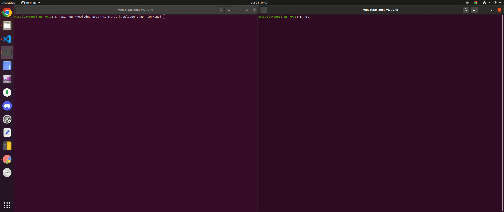

# knowledge_graph

Many times, when you are developing a Software Architecture for robots, you need shared memory where to store information. There are many strategies for this. One of them is a blackboard. Another approach is a graph in which we store elements as graph nodes and relations as graph edges.

ROS 2 knowledge graph provides you a way to share a graph between nodes running in an application. The graph is distributed in all the ROS 2 nodes. Each node contains a replica that is synchronized with all the other replicas, guaranteeing a Strong Eventual Consistency.

## Installation

```shell
$ cd ~/ros2_ws/src
$ git clone https://github.com/mgonzs13/knowledge_graph.git
$ pip3 install -r knowledge_graph/requirements.txt
$ cd ~/ros2_ws
$ rosdep install --from-paths src --ignore-src -r -y
$ colcon build
```

## Usage

### C++

```cpp
#include "rclcpp/rclcpp.hpp"
#include "knowledge_graph/knowledge_graph.hpp"

class NodeA : public rclcpp::Node {
public:
  NodeA() : rclcpp::Node("node_a") {
    this->graph_ = KnowledgeGraph::get_instance(shared_from_this());
  }

private:
  std::shared_ptr<knowledge_graph::KnowledgeGraph> graph_;
};


int main(int argc, char ** argv) {
  rclcpp::init(argc, argv);
  auto node = std::make_shared<NodeA>();
  rclcpp::spin(node);
  rclcpp::shutdown();
  return 0;
}
```

### Python

```python
import rclpy
from rclpy.node import Node
from knowledge_graph import KnowledgeGraph


class NodeA(Node):
  def __init__(self) -> None:
    super().__init__("node_a")
    graph = KnowledgeGraph.get_instance(self)


def main():
  rclpy.init()
  node = NodeA()
  rclpy.spin(node)
  rclpy.shutdown()


if __name__ == "__main__":
    main()
```

## API

### C++

The complete C++ API of `knowledge_graph::KnowledgeGraph` is at [knowledge_graph/include/knowledge_graph/knowledge_graph.hpp](knowledge_graph/include/knowledge_graph/knowledge_graph.hpp), but it is mainly:

- Nodes

```cpp
bool update_node(const knowledge_graph_msgs::msg::Node &node, bool sync = true);
```

```cpp
bool remove_node(const std::string node, bool sync = true);
```

```cpp
bool exist_node(const std::string node);
```

```cpp
std::optional<knowledge_graph_msgs::msg::Node> get_node(const std::string node);
```

```cpp
std::optional<knowledge_graph_msgs::msg::Node> get_node();
```

- Edges

```cpp
bool update_edge(const knowledge_graph_msgs::msg::Edge &edge, bool sync = true);
```

```cpp
bool remove_edge(const knowledge_graph_msgs::msg::Edge &edge, bool sync = true);
```

```cpp
std::vector<knowledge_graph_msgs::msg::Edge> get_edges(const std::string &source, const std::string &target)
```

```cpp
std::vector<knowledge_graph_msgs::msg::Edge> get_edges(const std::string &edge_class)
```

```cpp
std::vector<knowledge_graph_msgs::msg::Edge> get_out_edges(const std::string &source)
```

```cpp
std::vector<knowledge_graph_msgs::msg::Edge> get_in_edges(const std::string &target)
```

### Python

The complete Ptyhon API of `KnowledgeGraph` is at [knowledge_graph/knowledge_graph/knowledge_graph.py](knowledge_graph/knowledge_graph/knowledge_graph.py), but it is mainly:

- Nodes

```python
def update_node(self, node: Node, sync: bool = True) -> bool
```

```python
def remove_node(self, node: str, sync: bool = True) -> bool
```

```python
def exist_node(self, node: str) -> bool
```

```python
def get_node(self, node: str) -> Node
```

```python
def get_nodes(self) -> List[Node]:
```

- Edges

```python
def update_edge(self, edge: Edge, sync: bool = True) -> bool
```

```python
def remove_edge(self, edge: Edge, sync: bool = True) -> bool
```

```python
def get_edges(self, source: str = None, target: str = None, edge_class: str = None) -> List[Edge]:
```

```python
def get_out_edges(self, source: str) -> List[Edge]
```

```python
def get_in_edges(self, target: str) -> List[Edge]
```

## Demos


